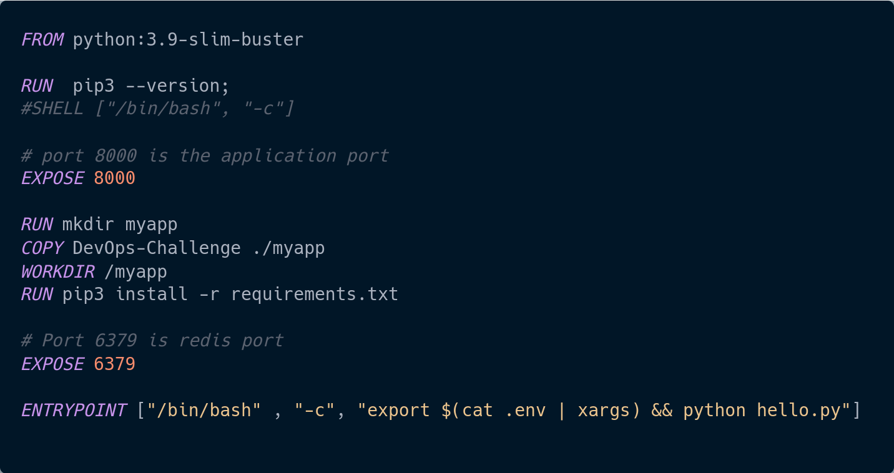
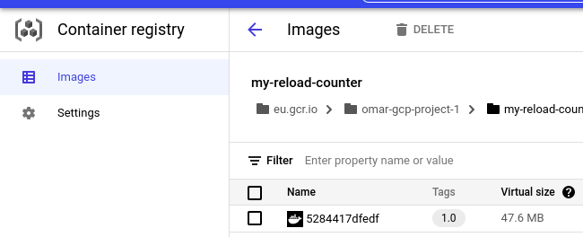
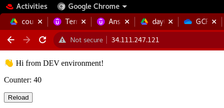

# Deploying A Python Application On GCP Using Terraform

## Project's Description

- Using Docker to dockerize the python application into an image
- Using GCR as our image repository to push the images to it
- Deploying the python application on a GKE cluster

## Requirments

1. Linux os, Windows or Mac os  
2. Docker to be installed 
3. A gcp account with a project and enabling billing account for it
4. The google cloud cli (gcloud) to be installed on your local machine [ Setup ](https://cloud.google.com/sdk/docs/install)
5. Terraform to be installed 

## Building Network infrastructure using terraform 

1. Created a vpc 
2. Created two subnets (managed & restricted) in the europe region
3. Created a firewall allowing only The IAP range to access 
4. Created a nat-gateway in order that my resources that will be created later  
   can access the internet safely  

## Steps

1. Clonnig the python app code from https://github.com/atefhares/DevOps-Challenge-Demo-Code.git repo
2. Creating a Dockerfile for the python app based on the requirments defined in the repo  

3. Building the image `docker build -t eu.gcr.io/omar-gcp-project-1/my-reload-counter:1.0  /Docker/`   
    Note That:  
    The image must be tagged as following ~> `[HostName registery]/[project-id]/[name]:[verison]`   
    [HostName registery]-> specify in which region your image will be stored in [ Document ](https://cloud.google.com/container-registry/docs/pushing-and-pulling) 
    `eu.gcr.io` means it will store the image in the europe region 
4. Authenticate your account with the gcloud tool `gcloud auth login` it will pop up a browswer page    
   where you can login with your gcp account
5. Make sure the account has `storage.admin` premisson in order to push images to GCR.
6. Configure Docker to authenticate to GCR from your local machine [Setup](https://cloud.google.com/container-registry/docs/advanced-authentication)
7. Pushing the image to GCR `docker push eu.gcr.io/omar-gcp-project-1/my-reload-counter:1.0`

8. Creating "Deployment-Templates" directory that contains deployments, ingress and service templates
9. Run `terraform apply --var-file dev.tfvars` to start the project
9. Creating GKE cluster using terraform  
   Note That:   
    we created a service account with `storage.admin` premisson in order that working nodes can  
    pull the images from gcr, the service accout is attached to the node pool which is attached  
    to the gke cluster 

10. Creating bastion host with a startup script `startup_script.sh` to communicate with Master node  
    Note That:   
    bastion host is created with no puplic ip using terraform and the startup script installs  
    kubectl tool which is used to communicate with Master node, moreover we created a service 
    account with container admin premission to have full access to gke cluster and attached 
    it to the bastion host while creating the bastion host from the terraform code
11. Now copy the kubernetes yaml files found in templates folder from your local machine to your  
    bastion host, type in the terminal:  
    `gcloud compute scp  --recurse ./Deployment-Templates  gke-bastion:~/ --project=omar-gcp-project-1`  
    Note that: "gke-bastion" is the name of the bastion host
12. Connect to your bastion host `gcloud compute ssh gke-bastion  --project=omar-gcp-project-1`  
    note that: there is no puplic ip added so gcloud will the IAP tunneling to reach  
    the bastion host
13. Authenticate the kubectl with gke cluster `gcloud container clusters get-credentials  my-gke-cluster `
14. Change directory to `Deployment-Templates` `cd ./Deployment-Templates`
15. run the following command to start all deploymet and service files. `kubectl create -Rf .` 

16. wait 3-5 minutes for the ingress to be running then run `kubectl get ingress` 

17. Copy the ip address to your browser. 

## Author

[Omar Kamal ](https://www.linkedin.com/in/omar-soliman-617188208/)
